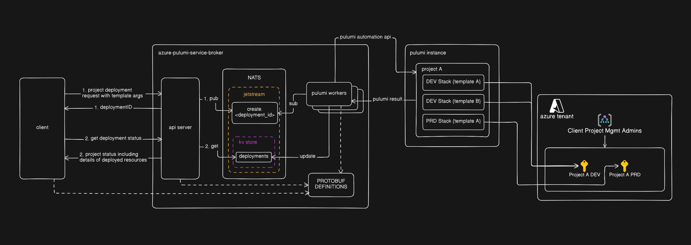

> [!NOTE]
> **AI Disclaimer**
> 
> As it's project meant for learning, this repo does not contain any AI generated code[^1] nor was the architecture ideated using AI. The documentation and write-up, however, are written with the assistance of an LLM. 
>
> My decision to not use AI to assist with programming my pet projects doesn't reflect an anti-ai sentiment for use during company work.

[^1]: Except for the `unwrapOneof` function [here](https://github.com/htemuri/azure-pulumi-service-broker/blob/6d9d739ead32ba770da6b086397bc3b27d360539/pkg/templates/template.go#L125). I couldn't figure out how to properly cast the [`isTemplates_Template` oneOf](https://github.com/htemuri/azure-pulumi-service-broker/blob/6d9d739ead32ba770da6b086397bc3b27d360539/pkg/templates/template.pb.go#L31) interface in my generated protobuf code to my custom interface for Template without having to manually write cases for each possible template that implemented `isTemplates_Template`.

# azure-pulumi-service-broker
A self-service API to provision Azure infrastructure using Pulumi instead of Terraform.

[^2]: Not actual pulumi templates as defined [here](https://www.pulumi.com/templates/). I wanted to use actual templates, but I was limited by the pulumi automation api's current capabilities (feature request for it can be found in [this issue](https://github.com/pulumi/pulumi/issues/16949).)


Clients send a gRPC request describing a "project" (an environment plus a set of resource templates), and the broker asynchronously provisions the corresponding Azure resources via Pulumi's Automation API. It then reports back status and outputs once the deployment finishes.

## Demo

[](https://youtu.be/xstuxZrgMb0)
 
## How it works


 
 
1. The broker API exposes a gRPC service with two RPCs: `CreateProject` and `GetProjectStatus`.
2. `CreateProject` generates a `deploymentId`, marshals the request as protobuf, and publishes it to a NATS JetStream stream (`ProjectJobQueue`).
3. The broker pulumi worker consumes jobs off that stream, runs the requested Pulumi programs against Azure, and writes the resulting status/output back to a NATS key-value bucket (`deployments`).
4. `GetProjectStatus` reads that KV store so clients can poll a `deploymentId` until it's `SUCCESS` or `ERROR`.

All the API contracts live in `proto/` and are compiled to Go with `protoc` (see the `proto` recipe in the `Justfile`).
 
## Templates
 
A project is composed of one or more templates[^2] that each provision a slice of infrastructure. I created a few sample templates as a proof of concept:
 
- **Base**: subscription (new or existing) and a virtual network, with subnets allocated from an Azure IPAM pool.
- **Security**: a key vault, optionally behind a private endpoint.
- **Storage**: a storage account (with configurable SKU/kind), optionally behind private endpoints for specific sub-resources (blob, dfs, queue, etc.).
- Whatever other templates you wish to create
 
## Requirements
 
- Go 1.x (see `go.mod`)
- A running NATS server with JetStream enabled
- An Azure service principal with rights to provision the resources you're requesting (e.g. `Owner`/`Contributor` on the target subscription or management group, plus Graph API permissions if creating Entra ID groups/service principals)
- A Pulumi access token (`PULUMI_ACCESS_TOKEN`)
- An existing Azure IPAM pool if you want the Base template to allocate a new VNet
See `.env.example` for the full list of required environment variables.
 
## Running it
 
**With Docker Compose** (spins up NATS, the broker API, and the Pulumi worker):
 
```bash
# if using docker
docker compose -f docker/docker-compose.yaml up -d
# or if you're using podman
podman compose -f docker/docker-compose.yaml up -d
```
 
**Locally, for development:**
 
```bash
just nats # to start the nats server
go run cmd/api/*.go # for the api
go run cmd/pulumi_worker/*.go # for the pulumi workers
```
 
The broker API listens on `:50051` by default.
 
## Example client
 
`examples/client/main.go` is a minimal gRPC client that builds a `CreateProjectRequest` (Base + Security + Storage templates), submits it, and polls `GetProjectStatus` until the deployment completes. Run it with:
 
```bash
go run examples/client/main.go
```
 
See `examples/client/README.md` for prerequisites and sample output.
 
## Project layout
 
```
cmd/api/            gRPC broker API entrypoint
cmd/pulumi_worker/   NATS consumer that runs Pulumi deployments
pkg/                 generated protobuf + supporting Go code
proto/               protobuf service/message definitions
docker/              Dockerfiles and docker-compose stack
examples/client/     sample gRPC client
```
 
### Potential Improvements
  - [ ] nats authentication and tls
  - [ ] maybe a helm chart to deploy the entire stack to k8s
  - [ ] attaching telemetry to the bundle
  - [ ] different "templates" for how projects are structured? like make project top level into resource groups instead of subscriptions
  - [ ] rollback feature?
  - [ ] option to export stack to files that can be pushed to a repo that keep it in sync
    - [ ] option to choose format of export [eg: terraform hcl, pulumi stack, arm, json, yaml?]
  - [ ] switch to pulumi templates stored on repos with pulumi.runFuncs and protobuf definitions for config args
  - [ ] separate dns zone creation
  - [ ] separate entra object and iam access provisioning
